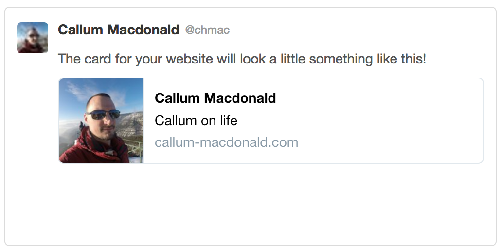
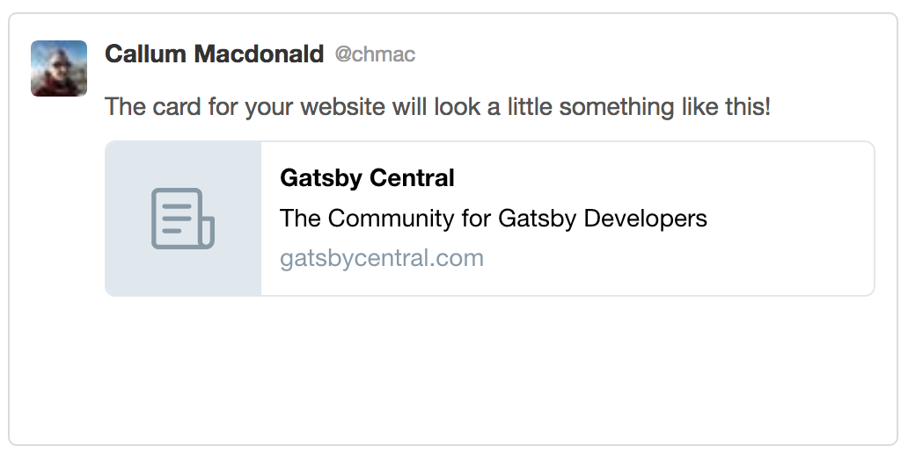

You want to set social meta tags. Or you want to set a page `<title>` tag. How does Helmet work?

> tl;dr Use`<Helmet>` just like `<head>` in both the layout and every page component.

## What are meta tags?

Meta tags are special tags in HTML. They are not displayed on the page. They tell search engines and social media sites about the page.

The most common is the page title. The aptly named `<title>` tag! Then there are description tags. Self explanatory, a description of the page.

## Social meta tags

Social meta tags are specifically for social media sites. These tags are read by sites like Facebook and Twitter. They are usually read when somebody posts a link to your site. They tell Facebook or Twitter what to display as a summary of your page.

Here's an example of a simple Twitter card. This is built from the page's social meta tags.



## Why do I care?

Two reasons. SEO and social.

The SEO benefits of good meta tags are pretty limited. The `<title>` tag is what appears on the search result page. It's important to have an appropriate title tag for each page.

Social media tags are more important. When users share links to your pages. You can provide an image to go with your content.  You can make your videos available directly inside social sites. You will get better social engagement with good meta tags.

## What do meta tags look like?

Here's a simple example of simple meta tags in plain HTML.

```html
<html>
<head>
  <title>GatsbyCentral</title>
  <meta name="description" content="The Community for Gatsby Developers" />
  <meta name="twitter:card" content="summary" />
  <meta name="twitter:site" content="@GatsbyCentral" />
```

This will generate a Twitter card like so.



## Meta tags in Gatsby

Gatsby is based on React. Helmet is a package to manage meta tags in React. Gatsby uses Helmet.

Helmet is very easy to get started with.

First, import helmet like so:

```javascript
import { Helmet } from "react-helmet";
```

Now create a `<Helmet>` block inside your `render()` function like so:

```javascript
return(
  <div>
    <Helmet>
      <title>Gatsby Central</title>
    </Helmet>
    ...
  </div>
)
```

## Layouts and pages

Helmet will automatically merge meta tags. Set your default tags in your layouts. Override them in your page components. You can use `<Helmet>` in any component.

With the example above in a layout, you could add this to a page:

```javascript
<Helmet>
  <title>Meta Tags in Gatsby</title>
</Helmet>
```

This title will overwrite the layout title.
