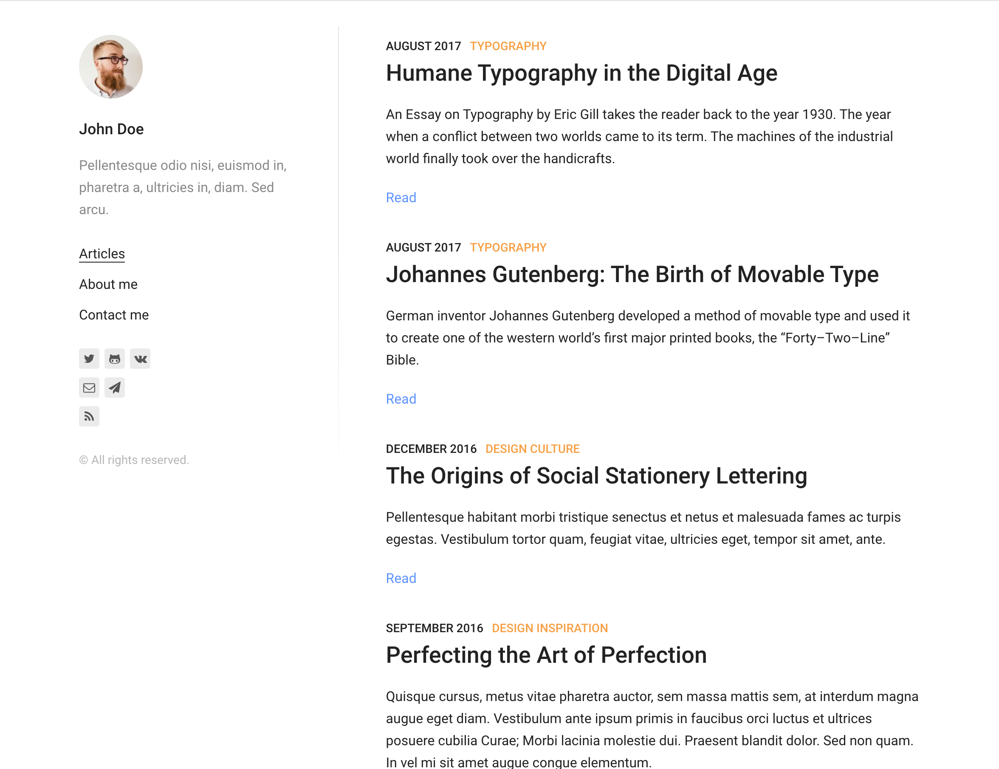

This tutorial will take ~30 minutes or so. We'll take a Gatsby starter and add comment support via StaticMan.

## Prerequisites

To follow this tutorial you will need:

* Git installed
* A GitHub account
* Node / npm (and preferably yarn) installed
* Gatsby installed (`npm -g install gatsby-cli`)

## NPM or yarn

This tutorial assumes you have installed [yarn](https://yarnpkg.com/en/docs/install). You can use npm instead, but you will need to convert the `yarn` comments to their `npm` equivalents. We recommend `yarn`.

## Fork the starter

To start the tutorial, fork [this repo](https://github.com/GatsbyCentral/staticman-tutorial) on GitHub. Once you have your own fork, clone that.

Detailed steps:

* Open the repository page
* Click the "Fork" button in the top right
* Click on the "Refresh" button
* Click on the green "Clone or download" button
* Copy the clone URL for this repository
* Run `git clone URL` in a terminal

You should now have a local copy of your freshly cloned repository in a directory called `staticman-tutorial`

## Start Gatsby

Start your freshly cloned Gatsby site.

* `cd staticman-tutorial`
* `yarn`
* `gatsby develop`

At this point  Gatsby should open chrome and load your Gatsby site. It should look like this:



Click on the first blog post. Comments are only visible on individual blog posts, not on the homepage.

## Comments section

Open the `src/components/PostTemplateDetails/index.jsx` file. Online 35 you should see `const commentsBlock = <div />`.

Replace the `<div />` with a "Comments" heading. It should look like this:

```javascript
const commentsBlock = (
  <div>
    <hr />
    <h2>Comments</h2>
    <p>No comments yet.</p>
  </div>
);
```

Now you should see this heading appear at the very bottom of the post.

Let's move `{commentsBlock}` from line 72 up to line 61, below the `{tagsBlock}` line. Now the comments should appear directly underneath the tags.

## Connect StaticMan

We need to give StaticMan access to our GitHub repository. You do this on your fork.

* Go to the Settings page for your GitHub fork
* Click on "Collaborators & Teams"
* Under the "Collaborators" heading
  - Type `staticmanapp` into the box
  - Click "Add collaborator"

Now you've invited StaticMan to your project. Next, tell StaticMan to accept your invitation. You do that by visiting a special URL. You need to know your GitHub username (where your fork lives) and the repository name (probably `staticman-tutorial`).

Then put those two values into the following URL:

`https://api.staticman.net/v2/connect/{your GitHub username}/{your repository name}`

The URL should look something like this:

https://api.staticman.net/v2/connect/GatsbyCentral/staticman-tutorial

Open **your** URL in your browser, and you should see the message "OK!".

## StaticMan config file

Now that you've connected StaticMan, the next step is to configure it.

Create a new file at the root of your repository called `staticman.yml`. Copy the contents from [the StaticMan sample config file](https://raw.githubusercontent.com/eduardoboucas/staticman/5c37482e13d7eb33cafe413c6c5b3a1a853a7d12/staticman.sample.yml).

> **NOTE** The filename must be exactly `staticman.yml`, not `.yaml` or otherwise.

The sample configuration is fine for this tutorial. You can read the comments in the file to learn more about the available options.

### Change `path`

We need to make one change to the staticman config file. On line 68 remove `{options.slug}` from the `path`. It should look like:

```yaml
path: "_data/comments"
```

## Commit & push

At this point, you need to commit your changes. Hopefully you're familiar with git already. If not, try the following commands in a terminal.

* `git add .`
* `git commit -m 'Configured staticman'`
* `git push`

Now when you look at your fork on GitHub, you should see the `staticman.yaml` file.

## Comment form

Now we want to create a form to submit comments. This is just a standard HTML form.

First, we need to construct the correct URL for the form. Just like above, you will need your GitHub username and fork name (`staticman-tutorial`). Then you create a URL like so:

    https://api.staticman.net/v2/entry/{your GitHub username}/{your fork name}/master/comments

Edit the `src/components/PostTemplateDetails/index.jsx` file again. After line 39, add a form like this:

```javascript
<h3>Add a comment</h3>
<form
  method="POST"
  action="YOUR_FORM_URL"
>
  <input
    name="options[slug]"
    type="hidden"
    value={this.props.pathContext.slug}
  />
  <input name="fields[name]" type="text" placeholder="Name" required />
  <input
    name="fields[email]"
    type="email"
    placeholder="Email"
    required
  />
  <textarea name="fields[message]" placeholder="Comment" required />
  <button type="submit">Submit Comment</button>
</form>
```

### Style the form

The form is unstyled at this point. Styling it is beyond the scope of this tutorial. It's just a standard HTML form, so you can style it using your preferred method.

## Commit and push

As above, commit these changes, and push them to GitHub.

* `git add .`
* `git commit -am 'Comment form.'`
* `git push`

## Test comment

Type a name, email, and comment. Then click the "Submit Comment" button. You should see a JSON success message if your comment was submitted. Now look at your GitHub fork. You should see a new Pull Request with your test comment. Merge this PR.

* Go the Pull Requests tab on GitHub
* Click on the new Pull Request
* Scroll down and click the green "Merge pull request" button
* Click "Confirm merge"

This commit is now in GitHub.

### Pull

After merging the PR, you need to pull.

`git pull`

Check that you have a file in `_data/comments`. This means you have successfully pulled your test comment from GitHub.

## Source comments

Now we have a comment, but it's not yet visible on the site. First, we need to add the `_data/comments` directory to our Gatsby config. This tells Gatsby to read this directory for comments.

Install the `gatsby-tranformer-yaml` plugin like so:

`yarn add gatsby-transformer-yaml`

Open the `gatsby-config.js` file.

After line 39, enable this plugin and create a new `gatsby-source-filesystem` by adding these lines:

```javascript
'gatsby-transformer-yaml',
{
  resolve: 'gatsby-source-filesystem',
  options: {
    path: `${__dirname}/_data/comments`,
    name: 'comments',
  },
},
```

You need to restart Gatsby at this point. You do that by pressing `ctrl`+`c` in the terminal, then running `gatsby develop` again.

Now your comment should be loaded into Gatsby's node system.

## Load comments

Open the `src/templates/post-template.jsx` file. Edit the GraphQL query to add the comments. Add the following after line 52.

```graphql
allCommentsYaml(filter: { slug: { eq: $slug } }) {
  edges {
    node {
      id
      name
      email
      message
      date
    }
  }
}
```

This will load the comments into the post template.

## Render comments

Open the `src/components/PostTemplateDetails/index.jsx` file again.

Add the following after line 9.

```javascript
const comments =
  this.props.data.allCommentsYaml && this.props.data.allCommentsYaml.edges
```

Above line 37 (`const commentsBlock = `) add the following:

```javascript
const commentsList =
  comments && comments.length ? (
    comments.map(comment => (
      <div key={comment.node.id}>
        <p>
          Name: {comment.node.name}
          <br />
          Comment: {comment.node.message}
          <br />
          Date: {comment.node.date}
        </p>
      </div>
    ))
  ) : (
    <p>No comments yet.</p>
  )
```

This is a bit complicated. It's doing several things.

* First, check if `comments` exists
* Second, check if `comments.length` is truthy (which means, there is at least 1 comment)
* If those two checks are true, then render a list of comments
* Otherwise, render the "No comments yet" message

The next step is to replace the `<p>No comments yet.</p>` block on line 58 with our new `commentsList` which looks like:

```javascript
{commentsList}
```

When you save this file, you should see your test file appear above the comment form.

## Success!

You can see all the changes we made in this tutorial [on GitHub here](https://github.com/GatsbyCentral/staticman-tutorial/compare/master...superlumen:master).

## Next steps

This tutorial does not cover any styling. You can style the form and comment output using your preferred method.

The comment output could also look much better. A few obvious upgrades include:

* Use the hashed email (`comment.node.email`) to show a Gravatar image for each comment
* Render an actual date instead of a timestamp
* Treat comment text as markdown

The goal of this tutorial was to show you the basics of how to connect StaticMan and Gatsby. Hopefully we've done that. If you found the tutorial useful, please let us know in the comments or consider sharing it on twitter, facebook, etc.

## Questions

If you have any issues with the tutorial, let us know in the comments below.
